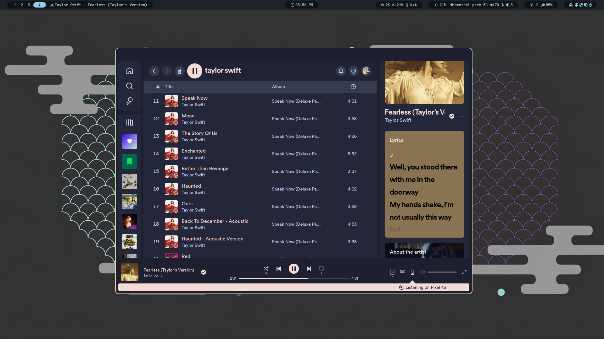

# Sources
- Desktop environment - [Hyprdots](https://github.com/prasanthrangan/hyprdots)

- fish - [Agnoster](https://github.com/oh-my-fish/theme-agnoster)

- nvim - [LazyVim](https://github.com/LazyVim/LazyVim)

- Firefox theme - https://github.com/datguypiko/Firefox-Mod-Blur

# Screenshots
| <b>kitty and fish</b>|
|----|
||

| <b>nvim </b>|
|----|
||

| <b>discord </b>|
|----|
||

| <b>spotify</b> |
|----|
||

